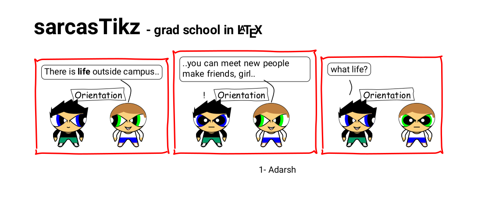
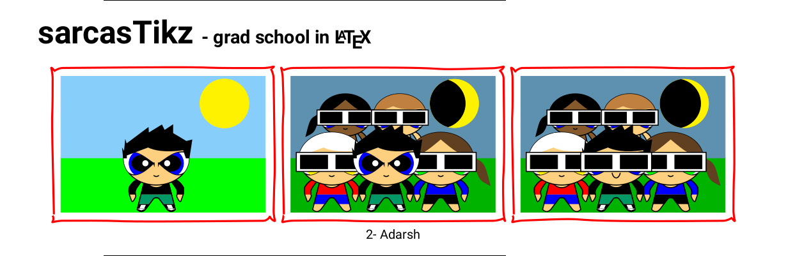
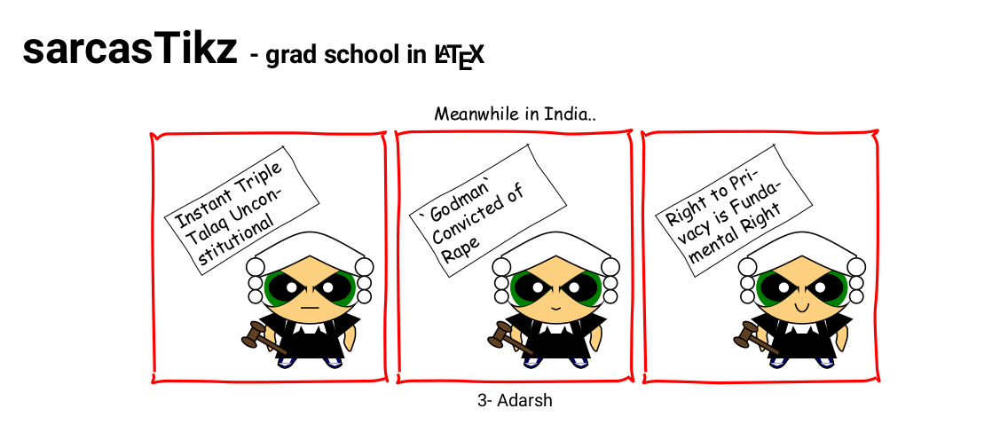
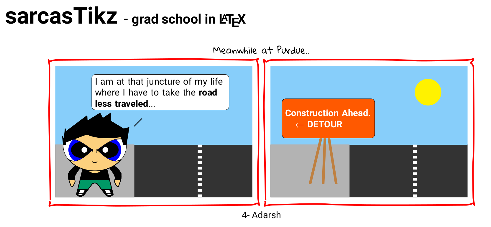
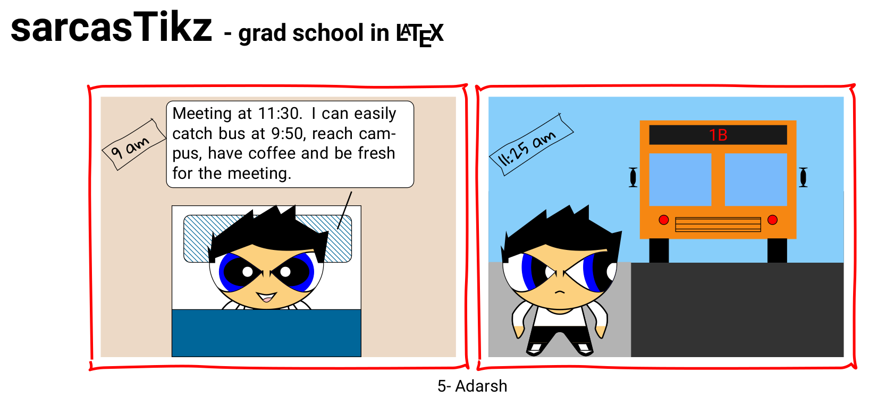
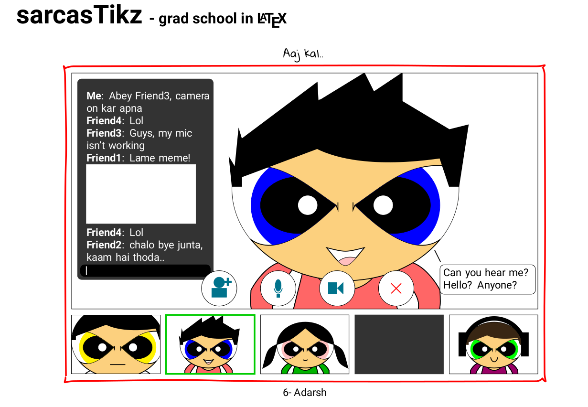

  <h1 align="center">sarcasTikz - grad school in LaTeX</h1>
    <h3 align="center">A comic strip completely done in LaTeX</h3>

 

    

<h2> </h2>

A comic strip depicting some days of my grad life done entirely in LaTeX (tikz).

## Everything in Chronological Order

    

    

    

    

    

    

